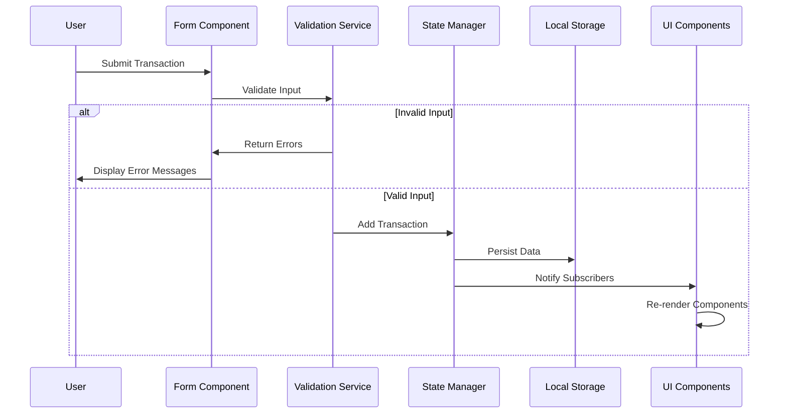

# Design Document: Expense & Budget Visualizer

## Overview

The Expense & Budget Visualizer is a client-side web application for tracking daily expenses. Built with vanilla HTML, CSS, and JavaScript, it provides a mobile-first interface for recording transactions, viewing total balance, and visualizing spending distribution through an interactive pie chart.

### Design Philosophy

- **Simplicity First**: Single-page application with minimal complexity
- **Mobile-First**: Responsive design starting from 320px viewport
- **Progressive Enhancement**: Works without JavaScript dependencies
- **Local-First Architecture**: All data stored client-side using Local Storage API

### Technology Stack

| Layer | Technology | Purpose |
|-------|------------|---------|
| Structure | HTML5 | Semantic markup, form elements |
| Styling | CSS3 | Flexbox/Grid layouts, responsive design |
| Logic | Vanilla JavaScript (ES6+) | DOM manipulation, state management |
| Data Storage | Local Storage API | Persistent client-side storage |
| Charts | Custom Canvas-based Pie Chart | No external dependencies |

---

## Architecture

### High-Level Architecture

```
┌─────────────────────────────────────────────────────────────────┐
│                         User Interface Layer                     │
│  ┌─────────────┐  ┌─────────────┐  ┌─────────────────────────┐  │
│  │   Balance   │  │ Input Form  │  │   Transaction List      │  │
│  │  Component  │  │  Component  │  │      Component          │  │
│  └─────────────┘  └─────────────┘  └─────────────────────────┘  │
│  ┌─────────────────────────────────────────────────────────────┐│
│  │                    Pie Chart Component                       ││
│  └─────────────────────────────────────────────────────────────┘│
└─────────────────────────────────────────────────────────────────┘
                              │
                              ▼
┌─────────────────────────────────────────────────────────────────┐
│                        Application Logic Layer                   │
│  ┌─────────────┐  ┌─────────────┐  ┌─────────────────────────┐  │
│  │   State     │  │ Transaction │  │    Validation           │  │
│  │  Manager    │  │   Service   │  │      Service            │  │
│  └─────────────┘  └─────────────┘  └─────────────────────────┘  │
│  ┌─────────────────────────────────────────────────────────────┐│
│  │                    Chart Renderer                            ││
│  └─────────────────────────────────────────────────────────────┘│
└─────────────────────────────────────────────────────────────────┘
                              │
                              ▼
┌─────────────────────────────────────────────────────────────────┐
│                         Data Persistence Layer                   │
│  ┌─────────────────────────────────────────────────────────────┐│
│  │              Local Storage Service                           ││
│  │         (CRUD operations, error handling)                    ││
│  └─────────────────────────────────────────────────────────────┘│
└─────────────────────────────────────────────────────────────────┘
```

### Data Flow Architecture

```
User Action → Event Handler → Validation → State Update → UI Re-render → Local Storage Sync
     │                                          │
     └──────────────────────────────────────────┘
                    (Reactive Updates)
```

### Component Communication Pattern

Components communicate through a centralized state manager using a publish-subscribe pattern:



---

## Components and Interfaces

### Component Hierarchy

```
App (Root Container)
├── BalanceDisplay
│   └── Total Balance Value
├── TransactionForm
│   ├── ItemNameInput
│   ├── AmountInput
│   ├── CategorySelect
│   └── SubmitButton
├── TransactionList
│   ├── EmptyState (conditional)
│   └── TransactionItem[]
│       ├── ItemName
│       ├── Amount
│       ├── Category
│       └── DeleteButton
└── PieChart
    ├── Canvas Element
    └── Legend
```

### Component Specifications

#### 1. BalanceDisplay Component

**Purpose**: Display the total sum of all transaction amounts prominently at the top of the viewport.

**Interface:**
```javascript
interface BalanceDisplayConfig {
  containerSelector: string;  // CSS selector for mount point
  formatter: (amount: number) => string;  // Currency formatter
}

interface BalanceDisplay {
  render(totalBalance: number): void;
  update(newValue: number): void;
}
```

**Behavior:**
- Updates within 100ms of transaction add/delete
- Displays "0" when no transactions exist
- Uses currency formatting (e.g., "Rp 0.00")

#### 2. TransactionForm Component

**Purpose**: Capture user input for new transactions with validation.

**Interface:**
```javascript
interface TransactionFormData {
  itemName: string;
  amount: number;
  category: 'Food' | 'Transport' | 'Fun';
}

interface ValidationResult {
  isValid: boolean;
  errors: Map<string, string>;  // field -> error message
}

interface TransactionForm {
  render(): void;
  reset(): void;
  validate(data: TransactionFormData): ValidationResult;
  onSubmit(callback: (data: TransactionFormData) => void): void;
}
```

**Validation Rules:**
| Field | Rule | Error Message |
|-------|------|---------------|
| Item Name | 1-100 chars (trimmed) | "Item name must be 1-100 characters" |
| Amount | > 0, max 9,999,999.99, 2 decimal places | "Amount must be greater than 0" |
| Category | Must be Food/Transport/Fun | "Please select a valid category" |

#### 3. TransactionList Component

**Purpose**: Display all transactions in reverse chronological order with delete functionality.

**Interface:**
```javascript
interface TransactionItem {
  id: string;
  itemName: string;
  amount: number;
  category: 'Food' | 'Transport' | 'Fun';
  createdAt: Date;
}

interface TransactionList {
  render(transactions: TransactionItem[]): void;
  addTransaction(transaction: TransactionItem): void;
  removeTransaction(id: string): void;
  onDelete(callback: (id: string) => void): void;
  showEmptyState(): void;
}
```

**Behavior:**
- Scrollable container with max-height constraint
- Empty state displays "No transactions recorded" message
- Delete triggers confirmation dialog
- New transactions appear within 1 second

#### 4. PieChart Component

**Purpose**: Visualize spending distribution by category.

**Interface:**
```javascript
interface CategoryTotal {
  category: 'Food' | 'Transport' | 'Fun';
  total: number;
  color: string;
  percentage: number;
}

interface PieChart {
  render(data: CategoryTotal[]): void;
  update(transactions: TransactionItem[]): void;
  showEmptyState(): void;
}
```

**Chart Colors:**
| Category | Color (Hex) | Visual Purpose |
|----------|-------------|----------------|
| Food | #FF6B6B | Warm red - sustenance |
| Transport | #4ECDC4 | Teal - movement |
| Fun | #FFE66D | Yellow - enjoyment |

#### 5. LocalStorageService

**Purpose**: Handle all data persistence operations with error handling.

**Interface:**
```javascript
interface StorageResult<T> {
  success: boolean;
  data?: T;
  error?: string;
}

interface LocalStorageService {
  getAll(): StorageResult<TransactionItem[]>;
  save(transaction: TransactionItem): StorageResult<void>;
  delete(id: string): StorageResult<void>;
  clear(): StorageResult<void>;
  isAvailable(): boolean;
}
```

---

## Data Models

### Core Data Entities

#### Transaction

```javascript
interface Transaction {
  id: string;           // UUID v4 format
  itemName: string;     // 1-100 characters, trimmed
  amount: number;       // Positive, 2 decimal places, max 9,999,999.99
  category: Category;   // Enum: Food, Transport, Fun
  createdAt: string;    // ISO 8601 timestamp
}

type Category = 'Food' | 'Transport' | 'Fun';
```

#### Application State

```javascript
interface AppState {
  transactions: Transaction[];
  totalBalance: number;
  categoryTotals: Map<Category, number>;
  isInitialized: boolean;
  lastError: string | null;
}
```

### Local Storage Schema

```javascript
// Key: 'expense_visualizer_transactions'
// Value: JSON stringified array of Transaction objects

interface StorageSchema {
  'expense_visualizer_transactions': Transaction[];
  'expense_visualizer_version': string;  // Schema version for migrations
}
```

### Data Validation Schema

```javascript
const VALIDATION_RULES = {
  itemName: {
    minLength: 1,
    maxLength: 100,
    pattern: /^[\s\S]*$/,  // Any character
    transform: (value: string) => value.trim()
  },
  amount: {
    min: 0.01,
    max: 9999999.99,
    decimals: 2,
    transform: (value: number) => Math.round(value * 100) / 100
  },
  category: {
    enum: ['Food', 'Transport', 'Fun'] as const
  }
};
```

---

## Error Handling

### Error Categories

| Category | Examples | User Message | Recovery |
|----------|----------|--------------|----------|
| **Validation** | Empty fields, invalid amount | Field-specific error | Highlight field, show message |
| **Storage** | Local Storage full/unavailable | "Unable to save data" | Display warning, keep in memory |
| **Data Corruption** | Invalid JSON in storage | "Data error detected" | Discard corrupted, load valid |
| **Browser** | Unsupported browser | "Browser not supported" | Show supported list |

### Error Handling Strategy

```javascript
interface AppError {
  code: ErrorCode;
  message: string;
  field?: string;
  recoverable: boolean;
}

enum ErrorCode {
  VALIDATION_ERROR = 'VALIDATION_ERROR',
  STORAGE_FULL = 'STORAGE_FULL',
  STORAGE_UNAVAILABLE = 'STORAGE_UNAVAILABLE',
  DATA_CORRUPTION = 'DATA_CORRUPTION',
  BROWSER_UNSUPPORTED = 'BROWSER_UNSUPPORTED'
}
```

### Error Display Flow

```
Error Occurs → Log to Console → Check Recoverability → Display User Message → Offer Recovery Action
```

---

## Testing Strategy

This feature involves UI rendering, user interactions, and simple CRUD operations with Local Storage. Property-based testing is **NOT appropriate** for the following reasons:

1. **UI Rendering**: The pie chart, form layouts, and transaction list are UI elements best tested with snapshot tests and visual regression tests.

2. **Simple CRUD Operations**: Adding/deleting transactions from Local Storage are straightforward operations without complex transformation logic.

3. **Validation Logic**: While validation could benefit from property-based testing, the rules are simple enough that example-based tests provide adequate coverage.

4. **Local Storage API**: Testing external browser APIs is better suited for integration tests with mocks.

### Testing Approach

#### Unit Tests (Jest + jsdom)

- **Form Validation**: Test each validation rule with valid and invalid examples
- **State Management**: Test add/remove/calculate operations
- **Data Transformation**: Test amount rounding, string trimming
- **Local Storage Service**: Test with mock storage

```javascript
// Example unit test structure
describe('TransactionService', () => {
  describe('addTransaction', () => {
    it('should add valid transaction and return it with generated ID', () => {
      const data = { itemName: 'Coffee', amount: 5.00, category: 'Food' };
      const result = transactionService.add(data);
      expect(result.id).toBeDefined();
      expect(result.amount).toBe(5.00);
    });
    
    it('should round amount to 2 decimal places using round half-up', () => {
      const data = { itemName: 'Item', amount: 5.555, category: 'Fun' };
      const result = transactionService.add(data);
      expect(result.amount).toBe(5.56);
    });
  });
});
```

#### Integration Tests

- **Form → State → UI Flow**: Test complete add transaction flow
- **Delete → Confirmation → UI Update**: Test deletion flow
- **Load → Render → State**: Test initial load from Local Storage

```javascript
describe('Add Transaction Flow', () => {
  it('should update balance, list, and chart when transaction added', async () => {
    // Setup app with mocked Local Storage
    // Fill form with valid data
    // Submit form
    // Assert balance updated
    // Assert list contains new transaction
    // Assert chart updated
  });
});
```

#### Visual/Snapshot Tests

- **Component Rendering**: Verify UI structure matches design
- **Responsive Layouts**: Test at 320px, 768px, 1024px viewports
- **Empty States**: Verify empty list/chart displays

#### Browser Compatibility Tests

- Manual testing in Chrome, Firefox, Edge, Safari (latest stable)
- Verify no console errors
- Verify visual alignment matches design specs

### Test Coverage Goals

| Area | Target Coverage | Test Type |
|------|-----------------|-----------|
| Validation Logic | 90% | Unit |
| State Management | 85% | Unit |
| Local Storage Service | 80% | Unit (mocked) |
| UI Components | 70% | Integration |
| Full Flows | 100% of AC | Integration |

---

## File Structure

```
expense-budget-visualizer/
├── index.html          # Single HTML file with semantic structure
├── styles.css          # Mobile-first responsive styles
├── app.js             # Main application logic
└── README.md          # Usage instructions
```

### File Responsibilities

#### index.html
- Semantic HTML5 structure
- Form elements with proper labels
- Accessible ARIA attributes
- No inline styles or scripts

#### styles.css
- CSS Custom Properties for theming
- Mobile-first media queries
- Flexbox/Grid for layouts
- Responsive typography (clamp/min/max)

#### app.js
- ES6+ modules (or single file for simplicity)
- Event delegation for performance
- Async-compatible (though not required for sync operations)
- Graceful degradation checks

---

## Algorithm Details

### Transaction ID Generation

```javascript
function generateId(): string {
  // UUID v4 compliant ID
  return 'xxxxxxxx-xxxx-4xxx-yxxx-xxxxxxxxxxxx'.replace(/[xy]/g, (c) => {
    const r = Math.random() * 16 | 0;
    const v = c === 'x' ? r : (r & 0x3 | 0x8);
    return v.toString(16);
  });
}
```

### Amount Rounding (Round Half-Up)

```javascript
function roundToTwoDecimals(amount: number): number {
  // Round half-up method: 5.555 → 5.56
  return Math.round((amount + Number.EPSILON) * 100) / 100;
}
```

### Total Balance Calculation

```javascript
function calculateTotalBalance(transactions: Transaction[]): number {
  return transactions.reduce((sum, t) => sum + t.amount, 0);
}
```

### Category Totals Calculation

```javascript
function calculateCategoryTotals(transactions: Transaction[]): Map<Category, number> {
  const totals = new Map<Category, number>([
    ['Food', 0],
    ['Transport', 0],
    ['Fun', 0]
  ]);
  
  for (const transaction of transactions) {
    const current = totals.get(transaction.category) || 0;
    totals.set(transaction.category, current + transaction.amount);
  }
  
  return totals;
}
```

### Pie Chart Segment Calculation

```javascript
function calculatePieSegments(transactions: Transaction[]): PieSegment[] {
  const total = calculateTotalBalance(transactions);
  if (total === 0) return [];
  
  const categoryTotals = calculateCategoryTotals(transactions);
  const segments: PieSegment[] = [];
  
  for (const [category, amount] of categoryTotals) {
    if (amount > 0) {
      segments.push({
        category,
        amount,
        percentage: (amount / total) * 100,
        color: CATEGORY_COLORS[category]
      });
    }
  }
  
  return segments;
}
```

### Pie Chart Drawing Algorithm

```javascript
function drawPieChart(canvas: HTMLCanvasElement, segments: PieSegment[]): void {
  const ctx = canvas.getContext('2d');
  const centerX = canvas.width / 2;
  const centerY = canvas.height / 2;
  const radius = Math.min(centerX, centerY) - 20;
  
  let startAngle = -Math.PI / 2;  // Start from top
  
  for (const segment of segments) {
    const sliceAngle = (segment.percentage / 100) * 2 * Math.PI;
    
    ctx.beginPath();
    ctx.moveTo(centerX, centerY);
    ctx.arc(centerX, centerY, radius, startAngle, startAngle + sliceAngle);
    ctx.closePath();
    ctx.fillStyle = segment.color;
    ctx.fill();
    
    startAngle += sliceAngle;
  }
}
```

---

## Function Signatures

### Core Application Functions

```javascript
// Application Initialization
function initApp(): void;

// State Management
function getState(): AppState;
function setState(newState: Partial<AppState>): void;
function subscribe(listener: (state: AppState) => void): () => void;

// Transaction Operations
function addTransaction(data: TransactionFormData): Transaction;
function deleteTransaction(id: string): boolean;
function getAllTransactions(): Transaction[];

// Validation Functions
function validateItemName(value: string): ValidationResult;
function validateAmount(value: number): ValidationResult;
function validateCategory(value: string): ValidationResult;
function validateTransaction(data: TransactionFormData): ValidationResult;

// Storage Functions
function saveToStorage(transactions: Transaction[]): StorageResult<void>;
function loadFromStorage(): StorageResult<Transaction[]>;
function isStorageAvailable(): boolean;

// UI Render Functions
function renderBalance(total: number): void;
function renderTransactionList(transactions: Transaction[]): void;
function renderPieChart(transactions: Transaction[]): void;
function renderEmptyState(): void;
function renderError(error: AppError): void;

// Utility Functions
function formatCurrency(amount: number): string;
function formatDate(date: string): string;
function debounce(fn: Function, delay: number): Function;
```

---

## UI/UX Design

### Layout Structure

```
┌─────────────────────────────────────┐
│           Total Balance             │  ← Top 15% of viewport
│           Rp 0.00                   │
├─────────────────────────────────────┤
│  ┌─────────────────────────────┐    │
│  │      Input Form             │    │  ← Form section
│  │  [Item Name____________]    │    │
│  │  [Amount__________] [Cat▼]  │    │
│  │       [Add Button]          │    │
│  └─────────────────────────────┘    │
├─────────────────────────────────────┤
│  ┌─────────────────────────────┐    │
│  │   Transaction List          │    │  ← Scrollable list
│  │   • Coffee - Rp 25,000  [X] │    │
│  │   • Taxi - Rp 50,000   [X]  │    │
│  │   • Movie - Rp 75,000  [X]  │    │
│  │                             │    │
│  └─────────────────────────────┘    │
├─────────────────────────────────────┤
│  ┌─────────────────────────────┐    │
│  │       Pie Chart             │    │  ← Canvas-based
│  │         ╱﹨                  │    │
│  │        ╱  ﹨                 │    │
│  │       ──────                │    │
│  │   [Food] [Transport] [Fun]  │    │  ← Legend
│  └─────────────────────────────┘    │
└─────────────────────────────────────┘
```

### Responsive Breakpoints

```css
/* Mobile First Approach */

/* Base styles: 320px - 768px (mobile) */
.container {
  display: flex;
  flex-direction: column;
  padding: 16px;
}

/* Tablet and Desktop: 768px+ */
@media (min-width: 768px) {
  .main-content {
    display: grid;
    grid-template-columns: 1fr 1fr;
  }
  
  .transaction-list {
    grid-column: 1;
  }
  
  .pie-chart {
    grid-column: 2;
  }
}
```

### Typography Scale

```css
:root {
  --font-size-xs: 12px;
  --font-size-sm: 14px;
  --font-size-base: 16px;   /* Minimum body text */
  --font-size-lg: 20px;     /* Minimum heading */
  --font-size-xl: 24px;
  --font-size-2xl: 32px;    /* Balance display */
}
```

### Color Palette

```css
:root {
  /* Primary Colors */
  --color-primary: #3498db;
  --color-secondary: #2c3e50;
  
  /* Category Colors */
  --color-food: #FF6B6B;
  --color-transport: #4ECDC4;
  --color-fun: #FFE66D;
  
  /* UI Colors */
  --color-background: #f8f9fa;
  --color-surface: #ffffff;
  --color-text: #2c3e50;
  --color-error: #e74c3c;
  --color-success: #27ae60;
}
```

### Accessibility Considerations

- **Focus Indicators**: Visible focus rings on all interactive elements
- **Tap Targets**: Minimum 44x44px for all buttons/inputs
- **Color Contrast**: WCAG AA compliant (4.5:1 ratio minimum)
- **Screen Reader Support**: ARIA labels, live regions for updates
- **Keyboard Navigation**: Full keyboard accessibility

---

## Design Decisions and Rationales

### Decision 1: Single-File Architecture

**Decision**: Use single HTML, CSS, and JavaScript files rather than modular structure.

**Rationale**: 
- Simplifies deployment and distribution
- Reduces HTTP requests for faster loading
- Easier for educational/maintainability purposes
- No build process required

**Trade-offs**: 
- (+) Simpler setup, easier to understand
- (+) No build tools needed
- (-) Harder to test in isolation
- (-) Code organization requires discipline

### Decision 2: Custom Canvas Pie Chart

**Decision**: Implement pie chart using HTML5 Canvas rather than external library.

**Rationale**:
- No external dependencies required
- Smaller bundle size
- Full control over rendering
- Learning opportunity for Canvas API

**Trade-offs**:
- (+) No dependency management
- (+) Smaller total file size
- (-) More code to maintain
- (-) Less feature-rich than Chart.js

### Decision 3: UUID for Transaction IDs

**Decision**: Use UUID v4 format for transaction identifiers.

**Rationale**:
- Guaranteed uniqueness without coordination
- No collision risk even across sessions
- Standard format for distributed systems
- Easy to generate client-side

**Trade-offs**:
- (+) No collision detection needed
- (+) No server coordination required
- (-) Longer than sequential IDs
- (-) Slightly more storage overhead

### Decision 4: Round Half-Up for Amounts

**Decision**: Round amounts to 2 decimal places using round half-up method.

**Rationale**:
- Matches common financial calculations
- Predictable behavior for users
- IEEE 754 rounding considerations handled

**Trade-offs**:
- (+) User-expected behavior
- (+) Consistent with financial standards
- (-) Requires careful implementation
- (-) Edge cases around 0.5 boundaries

### Decision 5: ISO 8601 for Timestamps

**Decision**: Store transaction timestamps as ISO 8601 strings.

**Rationale**:
- Standard format with timezone info
- Sortable as strings
- JSON serializable without transformation
- Easy to parse for display

**Trade-offs**:
- (+) Standard, interoperable format
- (+) Handles timezone correctly
- (-) Larger than Unix timestamps
- (-) Requires parsing for display

---

## Performance Considerations

### Rendering Performance

- **Debounce Input Validation**: 300ms delay on input validation
- **Batch DOM Updates**: Single re-render for multiple state changes
- **Virtual Scrolling**: Consider for > 100 transactions (future enhancement)

### Storage Performance

- **Lazy Loading**: Load transactions on app init, not on demand
- **Write Coalescing**: Single write per transaction (no batching needed for this scale)

### Initial Load Performance

- **Critical CSS**: Inline critical styles (consider for production)
- **Defer JavaScript**: Use `defer` attribute for script loading
- **Minimal Dependencies**: Zero external libraries = fast load

---

## Security Considerations

### Input Sanitization

```javascript
function sanitizeInput(value: string): string {
  // Remove HTML tags and trim whitespace
  return value.replace(/<[^>]*>/g, '').trim();
}
```

### XSS Prevention

- No `innerHTML` usage; use `textContent` for user data
- Escape special characters before any HTML rendering
- Content Security Policy headers (if served from server)

### Local Storage Security

- No sensitive data stored (financial data is user's own)
- Data stays client-side only
- No external API calls with stored data

---

## Browser Compatibility

### Required APIs

| API | Chrome | Firefox | Edge | Safari |
|-----|--------|---------|------|--------|
| Local Storage | ✓ | ✓ | ✓ | ✓ |
| Canvas 2D | ✓ | ✓ | ✓ | ✓ |
| Flexbox | ✓ | ✓ | ✓ | ✓ |
| CSS Grid | ✓ | ✓ | ✓ | ✓ |
| ES6+ | ✓ | ✓ | ✓ | ✓ |

### Feature Detection

```javascript
function checkBrowserCompatibility(): boolean {
  const hasLocalStorage = (() => {
    try {
      const test = '__storage_test__';
      localStorage.setItem(test, test);
      localStorage.removeItem(test);
      return true;
    } catch (e) {
      return false;
    }
  })();
  
  const hasCanvas = !!document.createElement('canvas').getContext;
  
  return hasLocalStorage && hasCanvas;
}
```

### Browser Support Message

```html
<noscript>
  <div class="browser-warning">
    This application requires JavaScript to function. 
    Please enable JavaScript in your browser settings.
  </div>
</noscript>
```
